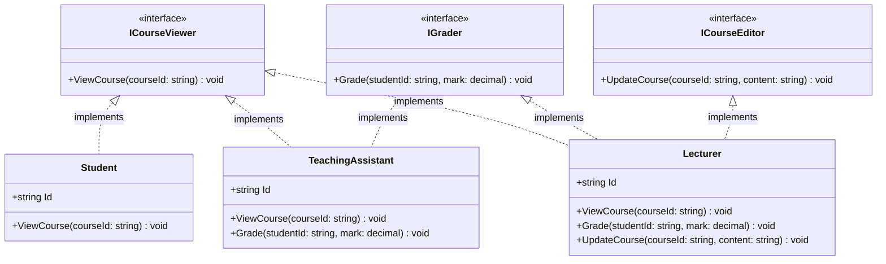
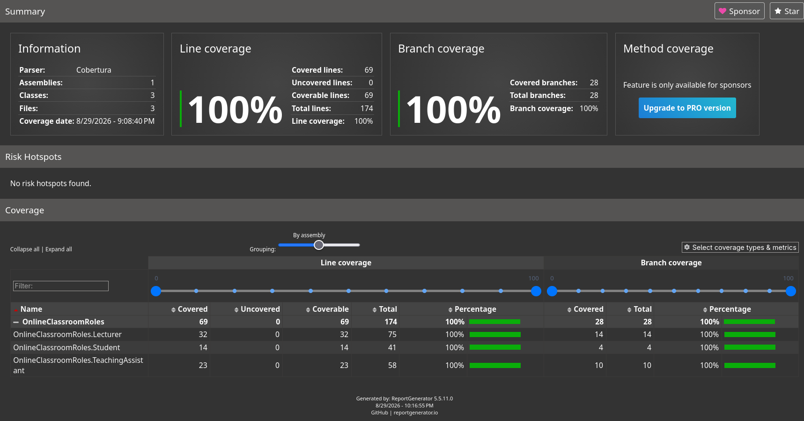

# Interface Segregation Principle

A project to demonstrate the _Interface Segregation Principle_ -- one of the five **SOLID** principles.

## Definition

From [Wikipedia](https://en.wikipedia.org/wiki/Interface_segregation_principle):

> Interface segregation principle (ISP) states that no code should be forced to
> depend on methods it does not use. ISP splits interfaces that are very large
> into smaller and more specific ones so that clients will only have to know
> about the methods that are of interest to them.

## Problem Statement

In short, the problem statement is:

> Roles in an online classroom (student, teaching assistant, and lecturer) have
> distinct but overlapping capabilities.
>
> Having one big interface consisting of all these capabilities forces classes
> for lower privilege roles to implement methods that they do not and _should_
> not implement.

## Objective

The objective is to:

> Model teaching, grading and course-viewing capabilities for an online
> classroom without giving every user one oversized interface and forcing roles
> to depend on methods that they doesn't use.

There are three roles involved:

1. Student
2. Teaching assistant
3. Lecturer

As the problem statement highlights, if we were to have one big interface with the capabilities of all of these roles, then the implementation classese for these roles would be forced to implement methods that they do not support. This approach is a violation of ISP.

Instead, the project has narrower, role-specific interfaces and the implementation classes implement mulitple such interfaces. This is in line with ISP and the implementation classes no longer have to implement any roles that they should not implement.

## Design Overview

There are three, role-specific interfaces that represent independent capabilities. The following list states them and the capabilities they have.

- `ICourseViewer`: viewing a course's materials
- `IGrader`: grading a student
- `ICourseEditor`: editing a course's content

These three replace the one big interface that we are attempting to avoid.

In terms of actual implementation classes, we have three of those, one per role. The following list states the classes and the interfaces they implement.

- `Student`: `ICourseViewer`
- `TeachingAssistant`: `ICourseViewer`, `IGrader`
- `Lecturer`: `ICourseViewer`, `IGrader`, `ICourseEditor`

With this approach, no class is forced to implement as method that they do not support.

## Class Diagram

The following diagram depicts the interfaces and the classes.



## Commands

Building and testing:

- Build the project using:

  ```bash
  dotnet build
  ```

- Run all test cases using:

   ```bash
   dotnet test
   ```

Test coverage report and visualization:

- Generate test coverage statistics:

  ```bash
  dotnet test --collect:"XPlat Code Coverage"
  ```

- Install [ReportGenerator](https://github.com/danielpalme/ReportGenerator) (a tool to visualize the test coverage report), if not already installed:

  ```bash
  dotnet tool install -g dotnet-reportgenerator-globaltool
  ```

- Generate HTML code coverage visualization using ReportGenerator:

  ```bash
  reportgenerator -reports:"**/coverage.cobertura.xml" -targetdir:"CoverageReport" -reporttypes:Html
  ```

Open `CoverageReport/index.html` in a browser to see the report.

## Test Summary

The test suite tests the following:

- **Role capabilities:** Each class implements only the required interfaces to enforce ISP.
- **Constructor guards:** Invalid arguments to constructors are rejected.
- **Argument validation:** Invalid arguments to methods are rejected.
- **Console execution:** For valid inputs, the methods behave as expected and write the expected values to console.

Here are some statistics related to the test cases:

| Target Class | Constructor Guards | Interface / ISP Exclusion | Method & Argument Validation | Console Output Verification | Total Tests |
|---|---|---|---|---|---|
| Student | 3 | 3 | 2 | 3 | 11 |
| TeachingAssistant | 3 | 3 | 5 | 4 | 15 |
| Lecturer | 3 | 3 | 6 | 5 | 17 |
| Total | 9 | 9 | 13 | 12 | 43 |

- Total Test Cases: 43
- Pass Rate: 100% (43 passed, 0 failed, 0 skipped)
- Line Coverage: 100% (69/69 lines)
- Branch Coverage: 100% (28/28 branches)

Below is the coverage report generated by ReportGenerator:



## Critical Analysis

| Design Aspect | Advantage | Limitation |
|---|---|---|
| Role Changes | Compiler blocks illegal calls instead of throwing runtime errors. | Roles are hardcoded to types. A user cannot be a TA in Course A and a Student in Course B without making new objects. |
| Code Maintenance | Keeps interfaces short and easy to read. | Adding new capabilities creates too many tiny interfaces, making the project somewhat cluttered. |
| Implementation Sharing | Each class only implements code it actually uses. | Roles with overlapping capabilities (like teaching assistant and lecturer) end up repeating logic unless you add base classes or composition. |


## Credits and References

- [`.gitignore`](./.gitignore) is taken from [github/gitignore/VisualStudio.gitignore](https://github.com/github/gitignore/blob/main/VisualStudio.gitignore).
- [`.editorconfig`](./.editorconfig) is taken from [github/chittur/observer-pattern-demo](https://github.com/chittur/observer-pattern-demo/blob/master/.editorconfig)
- [Interface Segregation Principle (Wikipedia)](https://en.wikipedia.org/wiki/Interface_segregation_principle)

